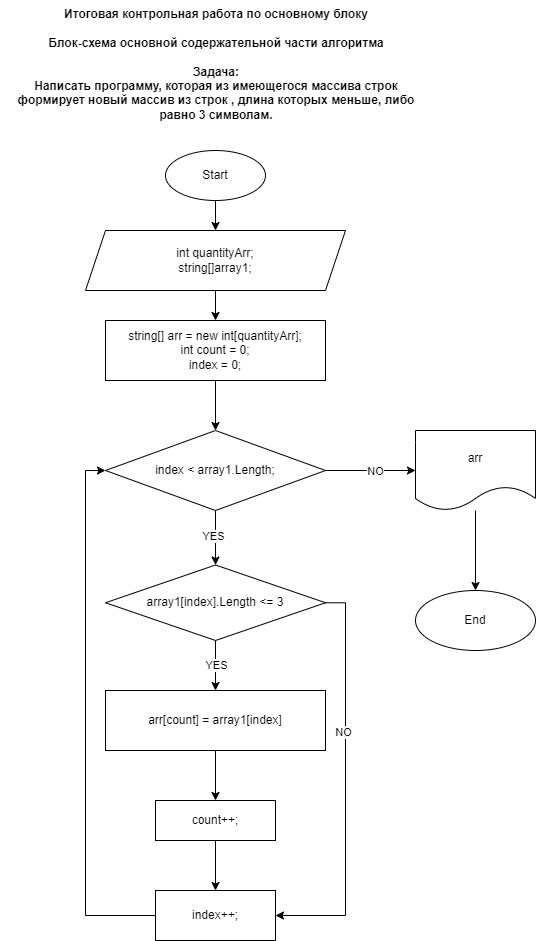

# 1. Блок-схема основной содержательной части алгоритма



# 2. Оформление репозитория текстовым описанием решения задачи (файл README.md).

## Примечание: 
* решение задачи выполнено на языке программирования *С#* c использованием методов;
* для простоты использования методов и читаемости в дальнейшем, задача разделена на несколько этапов, т.е применены несколько методов для решения задачи;
* условие задачи 
*<написать программу, которая из имеющегося массива строк формирует новый массив из строк, длина которых меньше, либо равна 3 символам. Первоначальный массив можно ввести с клавиатуры, либо задать на старте выполнения алгоритма. При решении не рекомендуется пользоваться коллекциями, лучше обойтись исключительно массивами>*.


# 2.1 Изучение условии задач и постановка стратегии его выполнения:
* Реализовать программу которая запрашивает пользователя о необходимости  ввода строк необходимой длины и количества;
* Реализовать метод вывода массива введённый пользователем и результирующий массив;
* Реализовать метод который определит из заданного массива количества строк с длинами которых меньше, либо равна 3 символам;
* Реализовать метод для подсёта количества элемента массива, длина которых меньше, либо равна 3 символам;
* Реализовать вызов метода для вывода результатов в ввиде массива **(по условию задачи не рекомендуется пользоваться коллекциями).** *"<Например:
[“Hello”, “2”, “world”, “:-)”] → [“2”, “:-)”];>"*

# 2.2 Программа запроса пользователя на ввод количества элементов массива и присвоение элементу переменное значение:
## * Для формирования запроса пользователю на ввод необходимого количества элементов в массиве, а так же конвертация в тип *int* и присвоение переменного значения введённого элемента пользователем  реализован так, 

```
Console.Write("Введите количество элементов в массиве: ");
int quantityElementArray = Convert.ToInt32(Console.ReadLine());
```

## * Метод формирующий запрос пользователя на ввод элементов массива в зависимости заданного количества элеменов в массиве реализован следующим образом,

```
string[] InputElementArray(int quantityElem)
{
    string[] quantityElemArray = new string[quantityElem];
    for (int i = 0; i < quantityElemArray.Length; i++)
    {
        Console.Write($"Введите {i + 1} элемент массива: ");
        quantityElemArray[i] = Console.ReadLine()!;
    }
    return quantityElemArray;
}
```
# 2.3 Метод вывода массива введеный пользователем, а так же результирующий массив реализован следующим образом:
```
string[] PrintArray(string[] array, char sep = '"')
{
    for (int i = 0; i < array.Length; i++)
    {
        if (i < array.Length - 1) Console.Write($"{sep}{array[i]}{sep}, ");
        else Console.Write($"{sep}{array[i]}{sep}");
    }
    return array;
}
```
* метод принимает массив состоящии из нескольких строк с типизацией *string* и выводит их в одну строку;
* в методе используется тип *char* для оформления при выводе массива кавычками и запятой.

# 2.4 Метод определяющий заданный массив с количеством строк длина которых меньше, либо равна 3 символам реализован следующим образом:
```
string[] PrintElemArray(string[] array1, int quantityArr)
{
    string[] arr = new string[quantityArr];
    int count = 0;
    for (int i = 0; i < array1.Length; i++)
    {
        if (array1[i].Length <= 3)
        {
            arr[count] = array1[i];
            count++;
        }
    }
    return arr;
}
```
* метод на вход принимает массив и его количество;
* создаём новый массив *`string[] arr = new string[quantityArr]`* заполненный нулями количество которых совпадает с количеством массива принимаемого на вход метода ;
* назначаем переменную *`int count = 0`* для подсчёта массивов с размером *`<= 3`*;
* создаём цикл *for* для выполнения итерации;
* создаём условие *`if (array1[i].Length <= 3)`* для проверки количества элеменов массива и в случае выполнения условия записываем его в массив *`arr[count] = array1[i]`* и выводим.
# 2.5 Метод для подсёта количества элемента массива, длина которых меньше, либо равна 3 символам реализован следующим образом:
```
int PrintQuantityElemStringArray(string[] array2)
{
    int strLength = 0;
    for (int i = 0; i < array2.Length; i++)
    {
        if (array2[i].Length <= 3) strLength++;  
    }
    return strLength;
}
```
* метод на вход принимает массив *`string[] array2`* ;
* назначаем переменную *`int strLength = 0`* для подсчёта количества массива с размером *`<= 3`*;
* создаём цикл *for* для выполнения итерации;
* создаём условие *`if (array2[i].Length <= 3)`* для проверки количества элеменов массива и в случае выполнения условия увеличиваем счётчик *`strLength++`* и выводим.

# 2.6 Реализация вызова методов для вывода результатов в ввиде исходного и результирующего массива:
```
string[] quantityArray = InputElementArray(quantityElementArray);
Console.Write("[");
PrintArray(quantityArray);
Console.Write("] -> ");

string[] arrayGivenElementLength = PrintElemArray(quantityArray, PrintQuantityElemStringArray(quantityArray));
Console.Write("[");
PrintArray(arrayGivenElementLength);
Console.Write("]");
```
* PrintArray(quantityArray) - вывод исходного массива который задан пользователем;
* PrintArray(arrayGivenElementLength) - вывод результирующего массива в котором содержется массив с количеством строк длина которых меньше, либо равна 3 символам.

